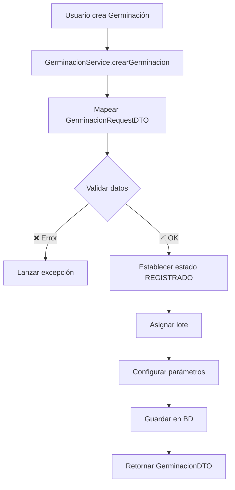
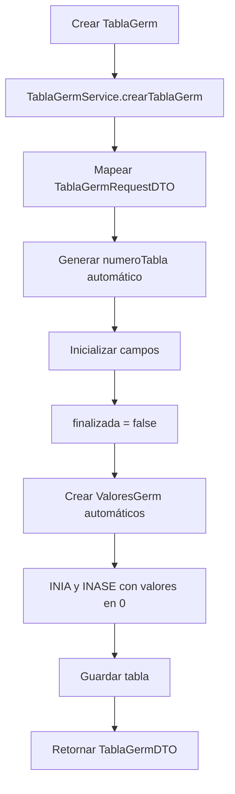
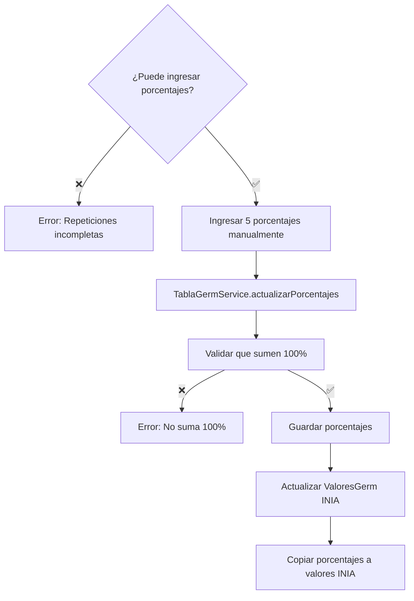
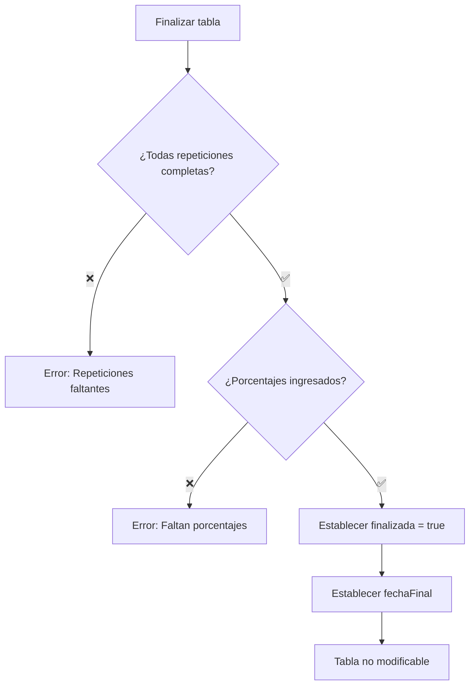
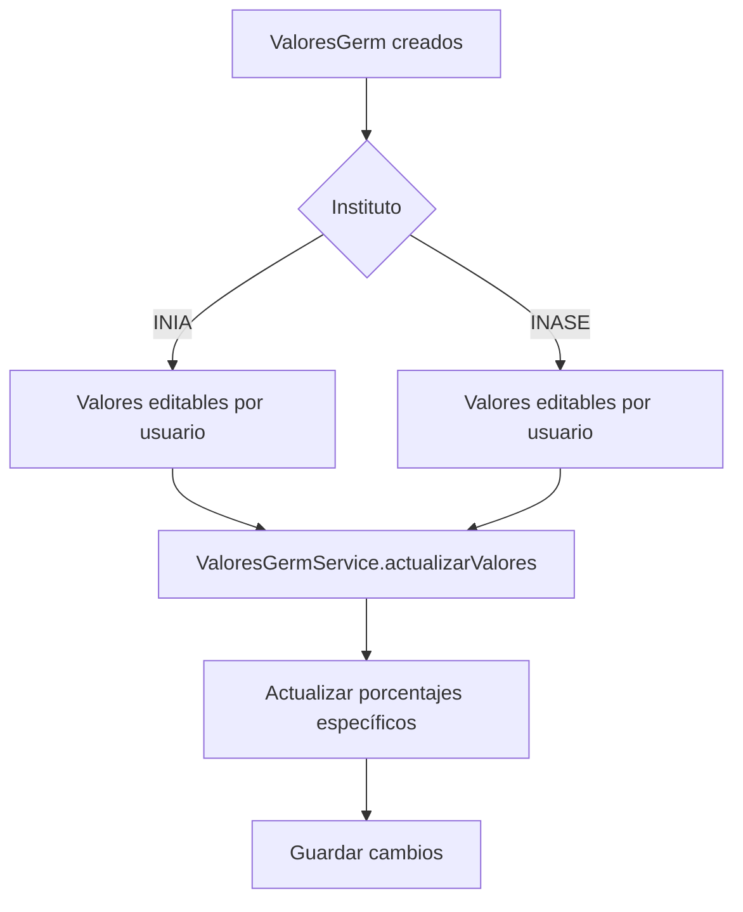
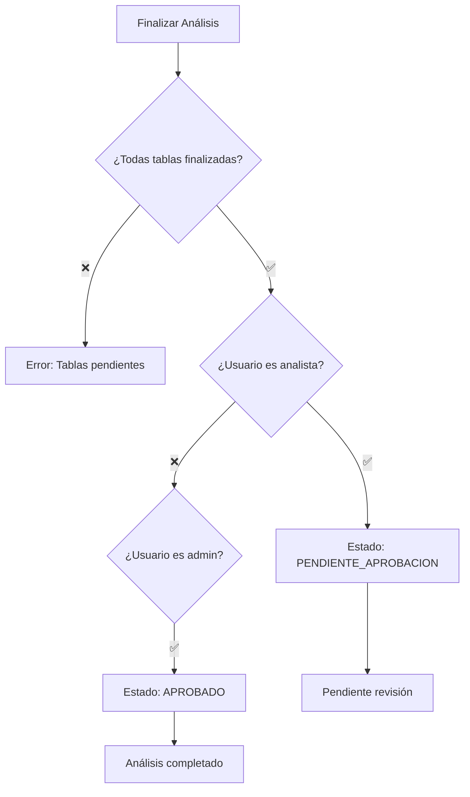

# Flujo de Proceso de Germinación en INIA

##  Visión General del Proceso

El análisis de germinación es uno de los procesos más complejos del sistema INIA, que involucra múltiples entidades y pasos secuenciales para evaluar la capacidad germinativa de las semillas.

## ️ Arquitectura de Entidades

```
Germinacion (Análisis base)
    │
    ├── TablaGerm (1 a N tablas)
    │   │
    │   ├── RepGerm (N repeticiones por tabla)
    │   │   └── normales[] (array de conteos por fecha)
    │   │
    │   └── ValoresGerm (valores por instituto: INIA/INASE)
    │       └── porcentajes finales calculados
    │
    └── fechaConteos[] (fechas de evaluación)
```

##  Flujo Completo del Proceso

### 1️⃣ **CREACIÓN DEL ANÁLISIS DE GERMINACIÓN**



**Datos requeridos:**
- `idLote`: ID del lote a analizar
- `fechaInicioGerm`: Fecha de inicio del análisis
- `fechaConteos[]`: Fechas de evaluación (no-null)
- `numeroRepeticiones`: Cantidad de repeticiones (>0)
- `numeroConteos`: Cantidad de conteos por repetición (>0)
- `numDias`: Duración del análisis
- `comentarios`: Observaciones opcionales

### 2️⃣ **CREACIÓN DE TABLAS DE GERMINACIÓN**



**Configuración de tabla:**
- `tratamiento`: Tipo de tratamiento aplicado
- `productoYDosis`: Producto y dosis utilizados
- `numSemillasPRep`: Número de semillas por repetición
- `metodo`: Método utilizado
- `temperatura`: Temperatura de germinación
- `prefrio`: Tratamiento de prefrío
- `pretratamiento`: Pretratamiento aplicado

### 3️⃣ **REGISTRO DE REPETICIONES**

```mermaid
graph TD
    A[Crear RepGerm] --> B[RepGermService.crearRepGerm]
    B --> C[Obtener TablaGerm]
    C --> D[Generar numRep automático]
    D --> E[Inicializar lista normales[]]
    E --> F{Validar numeroConteos}
    F --> G[Crear array con numeroConteos posiciones]
    G --> H[Llenar con valores del usuario o 0]
    H --> I[Calcular total automáticamente]
    I --> J{total <= numSemillasPRep?}
    J -->|❌| K[Error: Excede límite]
    J -->|✅| L[Guardar repetición]
    L --> M[Actualizar totales de tabla]
```

**Estructura de RepGerm:**
- `numRep`: Número de repetición (auto-generado)
- `normales[]`: Array de conteos normales por fecha
- `anormales`: Semillas anormales
- `duras`: Semillas duras
- `frescas`: Semillas frescas
- `muertas`: Semillas muertas
- `total`: Suma automática de todos los valores

### 4️⃣ **CÁLCULOS AUTOMÁTICOS**

```mermaid
graph TD
    A[Actualizar RepGerm] --> B[Calcular total individual]
    B --> C[Actualizar totales en TablaGerm]
    C --> D{¿Todas repeticiones completas?}
    D -->|❌| E[Mantener estado actual]
    D -->|✅| F[Calcular promedios sin redondeo]
    F --> G[Guardar promedioSinRedondeo[]]
    G --> H[Listo para ingresar porcentajes]
```

**Cálculos realizados:**
- **Total por repetición**: suma de normales[] + anormales + duras + frescas + muertas
- **Total de tabla**: suma de totales de todas las repeticiones
- **Promedios sin redondeo**: 5 valores promedio (normales, anormales, duras, frescas, muertas)

### 5️⃣ **INGRESO DE PORCENTAJES CON REDONDEO**



**Porcentajes requeridos:**
- `porcentajeNormalesConRedondeo`
- `porcentajeAnormalesConRedondeo`
- `porcentajeDurasConRedondeo`
- `porcentajeFrescasConRedondeo`
- `porcentajeMuertasConRedondeo`

### 6️⃣ **FINALIZACIÓN DE TABLA**



### 7️⃣ **GESTIÓN DE VALORES POR INSTITUTO**



### 8️⃣ **FINALIZACIÓN DEL ANÁLISIS COMPLETO**



##  Estados del Proceso

| Estado | Descripción | Acciones Permitidas |
|--------|-------------|-------------------|
| **REGISTRADO** | Análisis creado | Crear tablas, editar análisis |
| **EN_PROCESO** | Tablas en desarrollo | Crear repeticiones, finalizar tablas |
| **PENDIENTE_APROBACION** | Listo para revisión | Solo administradores pueden aprobar |
| **APROBADO** | Proceso completo | Solo consulta |
| **REPETIR** | Marcado para repetir | Reiniciar proceso |
| **INACTIVO** | Eliminado lógicamente | No accesible |

##  Validaciones Críticas

### ✅ Al crear Germinación:
- `numeroRepeticiones > 0`
- `numeroConteos > 0`
- `fechaConteos` debe tener elementos no-null
- Lote debe existir y estar activo

### ✅ Al crear RepGerm:
- Array `normales[]` debe tener tamaño = `numeroConteos`
- `total` no puede exceder `numSemillasPRep`
- Número de repeticiones no puede exceder `numeroRepeticiones`

### ✅ Al finalizar tabla:
- Todas las repeticiones esperadas deben estar completas
- Todos los porcentajes con redondeo deben estar ingresados
- Los porcentajes deben sumar 100%

### ✅ Al finalizar análisis:
- Todas las tablas deben estar finalizadas
- Usuario debe tener permisos adecuados

##  Flujo en el Frontend

```typescript
// 1. Crear análisis
const germinacion = await crearAnalisis(germinacionRequest);

// 2. Crear tabla
const tabla = await crearTablaGerm(germinacion.id, tablaRequest);

// 3. Crear repeticiones (loop)
for (let i = 0; i < numeroRepeticiones; i++) {
  await crearRepGerm(germinacion.id, tabla.id, repRequest);
}

// 4. Actualizar porcentajes
await actualizarPorcentajes(germinacion.id, tabla.id, porcentajes);

// 5. Finalizar tabla
await finalizarTabla(germinacion.id, tabla.id);

// 6. Finalizar análisis
await finalizarAnalisis(germinacion.id);
```

##  Ejemplo de Datos

```json
{
  "germinacion": {
    "numeroRepeticiones": 4,
    "numeroConteos": 3,
    "fechaConteos": ["2025-01-01", "2025-01-03", "2025-01-05"]
  },
  "tabla": {
    "numSemillasPRep": 100,
    "tratamiento": "Control"
  },
  "repeticion": {
    "normales": [20, 15, 10], // 3 conteos
    "anormales": 5,
    "total": 50 // Calculado automáticamente
  }
}
```

Este flujo asegura la integridad de los datos y la trazabilidad completa del proceso de análisis de germinación.